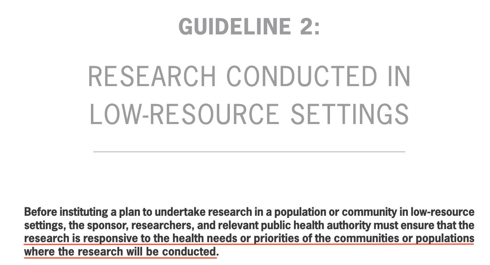

layout: true

background-image: url(images/MDCRC6430SlideBackground16-9.jpg)
background-size: cover

---


```{r setup, include = FALSE}
options(htmltools.dir.version = FALSE)
library(knitr)
library(xaringanExtra)
library(showtext)
library(kableExtra)
opts_chunk$set(echo=FALSE)

# set engines
knitr::knit_engines$set("markdown")


```
class: middle

.big[.blue[Objectives]

.blue[Part I]

* Evaluate and compare the nature of the patient-physician and investigator-subject relationship
* Explore the nature of role-based obligations in these relationships
* Explore whether, in clinical research, physicians can simultaneously discharge the obligations of physician and investigator


.blue[Part II]

* Discern ethical considerations when sponsors and investigators perform clinical research in low- and middle-income countries
* Explore the notions of social value and the responsiveness requirement in such international research]

<!-----------------------------Slide Break------------------------------------>

---

class: middle

.big[.blue[Obligations in clinical care compared to clinical research]

.blue[Clinical care (physician)]

* therapeutic beneficence

.blue[Clinical research (investigator)]

* avoidance of exploitation
* minimize potential harms, consistent with proper research design]

<!-----------------------------Slide Break------------------------------------>

---

class: middle

.big[.blue[The concept of a *fiduciary*]

This originated in the Law of Trusts:

* Grantor establishes a…

* Trust Corpus and…

* Appoints a Trustee to secure the interests of a…

* Beneficiary(ies)]

<!-----------------------------Slide Break------------------------------------>

---

class: middle

.big[.blue[Physician as a fiduciary]

* Physician has specialized knowledge

* Physician enters into a relationship of trust and understands his obligations to his patients

* Physician employs specialized knowledge to advance the medical interests of his patients

* Physician embraces the notion of loyalty and avoids conflicts of interest

Physicians are held to a duty of competent care.]

<!-----------------------------Slide Break------------------------------------>

---

class: middle

.big[.blue[Is an investigator a fiduciary ?]

* Investigator has specialized knowledge

* Investigator aims to acquire generalizable knowledge

* Investigator conceives a research design and applies it to a group(s) of people

* Investigator .purple[may or may not] have an antecedent relationship with respect to enrolled participants ]

<!-----------------------------Slide Break------------------------------------>

---

class: middle

.big[.blue[Physician-investigator as fiduciary]

A patient seeks medical care in the context of a patient-physician relationship

A physician offers trial participation in the context of a medical consultation

1. Can trial participation be consistent with competent personalized medical care ?

2. Under what circumstances can trial participation be .purple[optimal] care or, at least, an .purple[optimal management] strategy ?]

<!-----------------------------Slide Break------------------------------------>

---


class: middle

.big[.blue[Consider a scenario:]

A patient with metastatic breast cancer is referred to Dr. Jones. She is aware that high-dose chemotherapy with hematopoietic stem cell transplantation is being touted as a promising new treatment and plans to request it. Dr. Jones believes the biological rationale is plausible and has recently used it in two patients. After evaluating the patient, he decides she is a reasonable candidate for the therapy and proposes it to her.

Is his management recommendation consistent with competent medical care ?]

<!-----------------------------Slide Break------------------------------------>

---

class: middle

.big[.blue[A scenario with a thought experiment:]

A patient with metastatic breast cancer is referred to Dr. Jones. She has heard that high-dose chemotherapy with hematopoietic stem cell transplantation is being touted as a promising new treatment. You are her friend. She asks you whether she should ask her for this treatment. You reply that you are aware that a survey (conducted under the auspices of the main oncology professional society) of practising oncology members about their views of this treatment has just been published. Sixty percent of the responding oncologists believe the treatment to be superior to current standard therapy and plan to use it for some of their patients. How would you advise her?]


<!-----------------------------Slide Break------------------------------------>

---

class: middle

.big[.blue[What about this different scenario ?]

A patient with metastatic breast cancer is referred to Dr. Jones. She is aware that high-dose chemotherapy with hematopoietic stem cell transplantation is being touted as a promising new treatment and plans to request it. Dr. Jones believes the biological rationale is plausible and has recently used it in two patients.  

He is aware that other oncologists have questioned the evidential warrant for the therapy, and that a RCT comparing it to standard therapy has just been initiated in his medical center. He has agreed to be the local P.I. for the protocol.

If he believes she meets the eligibility criteria (inclusion and exclusion) but decides .purple[*not*] to mention the availability of the trial to her, is this decision unethical ? ]

<!-----------------------------Slide Break------------------------------------>

---

class: middle

.big[.blue[The architecture of clinical trials: the example of oncology ]

1. Phase I 

 -- Ascertainment of maximum tolerated dose for…

2. Phase 2

 -- Use of investigational drug in persons with a particular condition. Outcome measure: tumor response

3. Phase 3

 -- Randomized Controlled Trials]

<!-----------------------------Slide Break------------------------------------>

---

class: middle

.big[.blue[Equipoise and random allocation in the *randomized controlled trial*]

.blue[Equipoise]

A state of epistemic uncertainty about the relative merits (considering both potential benefits and harms) of comparator interventions.

.blue[Random Allocation]

How different is this randomness from the random circumstance of a patient's visit to a particular physician ?]

<!-----------------------------Slide Break------------------------------------>
---

class: middle


<!-----------------------------Slide Break------------------------------------>
---

class: middle

.blue[Direct quote:]


<!-----------------------------Slide Break------------------------------------>
---

class: middle

.big[.blue[Equipoise and randomized controlled trials]

* Patients’ choice (or referral to) of physician is random

* Individual physicians’ management preferences may not be *evidence-based*

* In a state of epistemic uncertainty, randomization (2-arm trial) offers the optimal hedging strategy: 50% odds of getting the superior treatment

* What is the .purple[track record] of randomized trials ? How often is the investigational/innovative arm better ? What is the implication of this .purple[record]  for the conduct of such trials ?]

<!-----------------------------Slide Break------------------------------------>

---

class: middle

.pull-left[


]

--

.pull-right[


]

<!-----------------------------Slide Break------------------------------------>

---

class: middle

.bigger[.blue[Part II. The Investigator-Community Relationship in International Research.]]

<!-----------------------------Slide Break------------------------------------>
---

class: middle

.center[.bigger[.blue[Declaration of Helsinki -- availability requirement]]]


<!-----------------------------Slide Break------------------------------------>

---
class: middle

.big[.blue[Potential problems with the *post-trial provision* requirement]]

* there is often a substantial delay between the completion of the trial, the analysis of the results, the regulatory approval of an efficacious intervention, and its manufacture and distribution

* the intervention may require ancillary procedures (e.g., special storage and administration equipment) not generally available in the host country(ies)

* the intervention (and/or ancillary procedures) may not be afordable in the host country(ies)


<!-----------------------------Slide Break------------------------------------>
---
class: middle

.pull-left[

]

.pull-right[



<hr>

<br>


.center[.big[.blue[CIOMS -- Responsiveness requirement]]]
]

<!-----------------------------Slide Break------------------------------------>

---

class: middle


<!-----------------------------Slide Break------------------------------------>

---


class: middle, center


<!-----------------------------Slide Break------------------------------------>

---
class: middle

.big[.blue[Potential issues with the *benefits* requirement:]]

* What kinds of benefits meet this requirement ? -- Medical products ? Medical equipment and other physical items ? Instruction in research procedures ? Financial ? Other ?

* Must the host community -- in additional to trial participants -- always realize benefits ?

* the notion of *benefits* raises the issue of exploitation:

Exploitation is a situation in which one party -- the alleged exploiter -- realizes a disproportionate (unfair) benefit in a transaction or situation.

How does one decide what's *unfair* ?


<!-----------------------------Slide Break------------------------------------>
---
class: middle

.center[.bigger[.blue[The 10/90 Gap]]]

.big[About 90% of the global burden of premature mortality can be attributed to diseases that primarily affect populations of the developing world, but only 10% of the annual global research budget of $50 billion to $60 billion is targeted at those diseases<sup>1</sup>.
]

<br>
.small[1. London A. *Responsiveness to Host Community Health Needs* The Oxford Textbook of Clinical Research Ethics (2008)]

<!-----------------------------Slide Break------------------------------------>

---

class: middle

.center[.big[.blue[International research, justice, and the human development approach<sup>1</sup>]]]

-- Justice: developed societies have some historical responsibility for the current (unjust) distribution of resources and associated social/medical ills.

-- Human development: not all health needs and medical uncertainties are of equal importance. Health care priorities are relevant: fundamental requirements to enable individuals to secure the most basic life opportunities and accomplishments. 

<br>

.smaller[1. See *London* reading in syllabus ]

<!-----------------------------Slide Break------------------------------------>
---

class: middle, center


<!-----------------------------Slide Break------------------------------------>

---

class: middle

.pull-left[.blue[Case for discussion]

A U.S. - based company proposes to conduct a trial of a new surfactant drug used to treat premature newborns at risk of developing respiratory distress syndrome. The Sponsor does not necessarily anticipate that the agent will be superior to FDA-approved agents currently available in the U.S. But production of this agent is relatively simple, and may translate into a cheaper product. The proposed trial is designed as a placebo-controlled trial. 

Because synthetic surfactant is not routinely available in many resource-poor countries, the trial will be conducted in four particular Latin American countries, and specific hospitals in certain regions where synthetic surfactant is ostensibly never used will be targeted for recruitment. 
]

--

.pull-right[.blue[Questions]


Is the conduct of a placebo-controlled trial in these countries ethical ?

Are there alternative research designs that would better meet requirements for ethical research in these countries ?


Would the conduct of the trial be [per se] exploitative ?

Does the research address important health needs in the host communities ?

What might “post-trial provision..” mean in this research ?
]

<!-----------------------------Slide Break------------------------------------>

